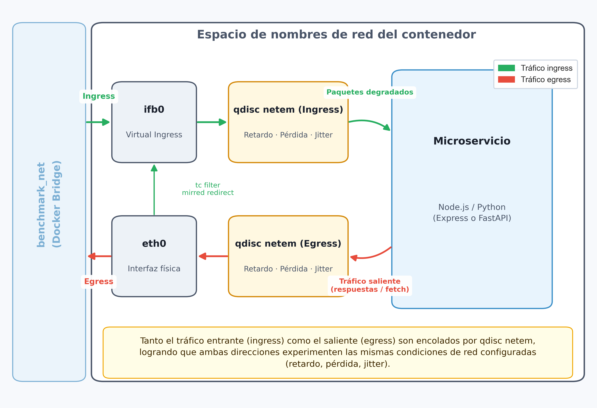
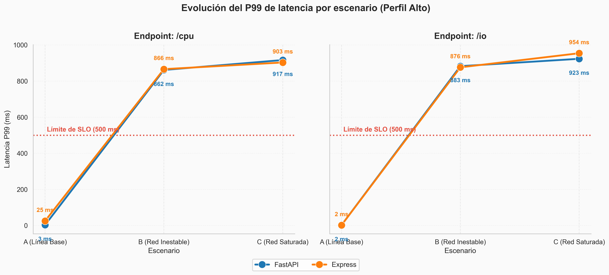

# Impacto del rendimiento de FastAPI vs Express.js bajo degradación de red

[](https://doi.org/10.5281/zenodo.22841248)

Tesis de grado — evaluación empírica del rendimiento de dos frameworks
backend (FastAPI, Express.js) bajo condiciones de red degradada,
simulando infraestructura de telecomunicaciones ecuatoriana mediante
Ingeniería del Caos (tc/netem).

## Arquitectura



## Resultados clave



## Cómo correr el experimento

```bash
docker compose up -d
./scripts/orchestration/run-baseline.sh
```

## Estructura del repositorio

- `services/` — código de los backends FastAPI y Express.js instrumentados
- `scripts/orchestration/` — scripts que ejecutan cada escenario de red (A: ideal, B: inestable, C: caos)
- `scripts/analysis/` — pipeline de análisis estadístico y generación de gráficas
- `resultados/tablas/` — CSVs agregados y tablas LaTeX generadas
- `resultados/graficas/` — gráficas finales usadas en la defensa

## Dataset completo

Los datos crudos completos (~10GB, todas las repeticiones y escenarios,
más los CSVs de latencias/errores/GC por petición individual)
están publicados en Zenodo: [10.5281/zenodo.22841248](https://doi.org/10.5281/zenodo.22841248)

## Stack técnico

Docker · tc/netem · k6 · FastAPI · Express.js · pandas · matplotlib · seaborn
